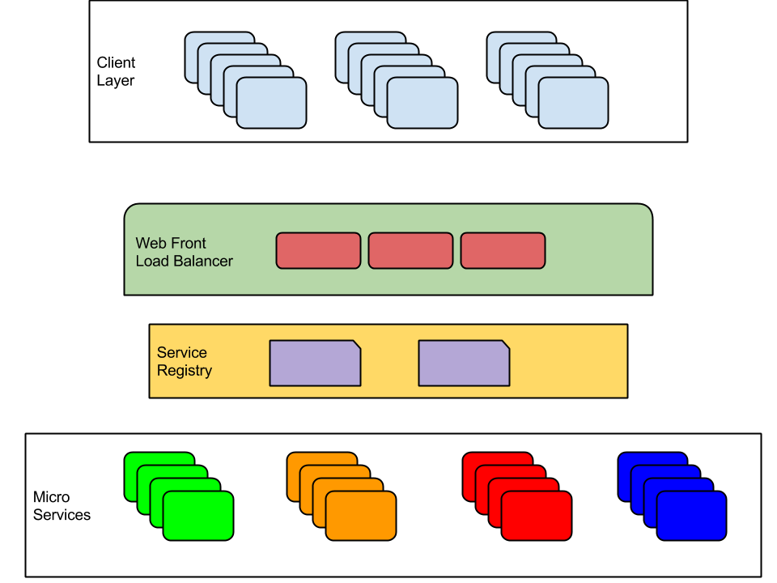

#Microservices using Async Libraries and MongoDB

##Outline
###Agenda
- Architecture definition
- Dataset extrapolation
- Services layout
- Team Setup

###Abiding Laws
- One verb per single function micro-service
- One developer produces one micro-service
- Each micro-service has it's own build
- Statefull data access layer
- Synchronization process is it's own micro-service
- We store data into MongoDB
- We expose services using Flask
- Everything else is your choice

###Fundamentals
- Versioning
  - we can have several different versions of the same service running
  - we don't need to shutdown previous
- Deployment
  - We will be deploying in containers
  - Docker for the rescue
- Separate Data Store for each service
  - we need to manage the synchronization of the master data
  - this will be a separate service!
- Treat Severs as Stateless
  - don't worry about a particular server
  - just make sure you have enough to keep the service running and scalable

### Architecture review
Microservices architecture generally follows the following schematics:

Your Client Layer will push requests, orchestrated by a load balancer (like ELB) and then get served that request by a webserver.
This webserver will know which micro-service to call for the different required services by checking the Service Registry (something like Zookeeper or Netflix Eureka).

And then you might have several different services that respond to a specific _"one verb"_ kind of function of your overall application

### What we are *NOT* going to be doing today!
For this exercise we are not going to put the complex _Service Registry_ or _Load Balancer_ in motion because (well, I'm a bit lazy) of time restrictions and because the overall exercise is around optimization of processes and Async sugar.

### What we are going to be doing
Going to start with a monolithic web application:
- Based on [Flask][12] that will allows us to do certain functions
  - search for reddit posts (and other datasources)
  - show recommended pots based on topics
  - tag those posts according with user preferences

Then we will migrate the code base from a pure monolithic approach to REST
- Based on [Eve][13]
  - same type of functionality but replacing underlying calls to a Rest API
  - slowly decomposing the system into services and starting to integrate async

By the end of the exercise we should have completely decomposed into services
- Each individual function will be running on a separate services
  - containerized
  - modularized
  - scalable

### Workshop Resources
#### System Requirements
- [Python 2.7][17]
- [MongoDB 3.0][16]
- [System Admin][18]
#### Optional
- [Docker][20]
- [VirtualEnv][19]

#### Workshop code
- [Github Repo][21]
- [Eve][13]
- [Flask][12]
- [Pymongo][22]
- [Ipython][23]

### Monolithic Approach
We will keep it simple and use a pre-canned application that contains the bare minimum to get started:

[1]:http://microservices.io/patterns/service-registry.html
[2]:http://jasonwilder.com/blog/2014/07/15/docker-service-discovery/
[3]:http://martinfowler.com/articles/microservices.html
[4]:http://techblog.netflix.com/
[5]:https://github.com/Netflix/eureka
[6]:http://www.objectmentor.com/resources/articles/srp.pdf
[7]:http://plainoldobjects.com/presentations/building-and-deploying-microservices-with-event-sourcing-cqrs-and-docker/qconsf-2014-building-and-deploying-microservices-with-event-sourcing-cqrs-and-docker/
[8]:http://cppmicroservices.org/doc_latest/index.html
[9]:http://highscalability.com/blog/2014/4/8/microservices-not-a-free-lunch.html
[10]:http://techblog.netflix.com/2013/06/announcing-zuul-edge-service-in-cloud.html
[11]:http://blog.miguelgrinberg.com/
[12]:http://flask.pocoo.org/
[13]:http://python-eve.org/
[14]:https://docs.angularjs.org/tutorial
[15]:https://sroze.github.io/ngInfiniteScroll/#
[16]:https://www.mongodb.org/downloads
[17]:https://www.python.org/downloads/release/python-2710/
[18]:https://en.wikipedia.org/wiki/System_administrator
[19]:https://virtualenv.pypa.io/en/latest/
[20]:https://www.docker.com/
[21]:https://github.com/nleite/asyncmicroservices
[22]:http://api.mongodb.org/python/current/
[23]:http://ipython.org/
//end
