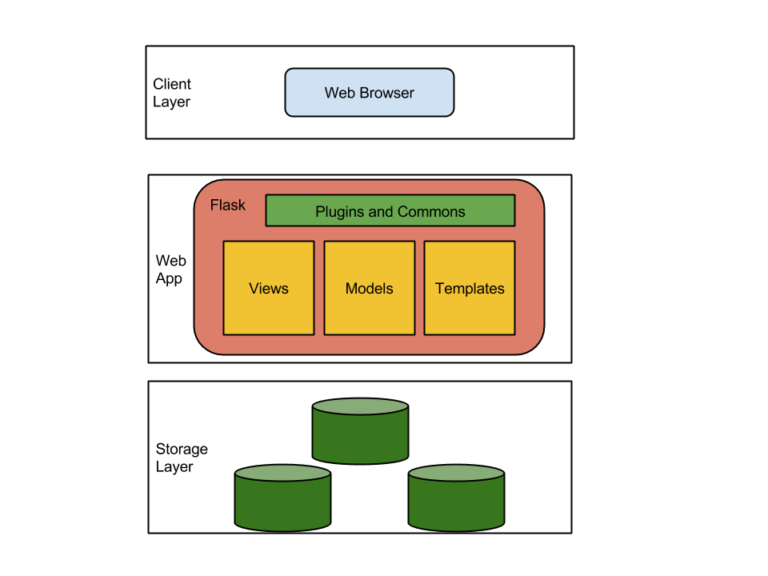
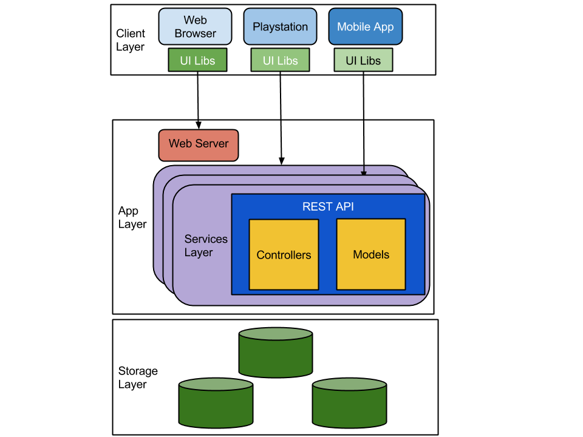

# Microservices using Async Libraries and MongoDB

## Outline
### Agenda
- Architecture definition
- Dataset extrapolation
- Services layout
- Team Setup

### Abiding Laws
- One verb per single function micro-service
- One developer produces one micro-service
- Each micro-service has it's own build
- Statefull data access layer
- Synchronization process is it's own micro-service
- We store data into MongoDB
- We expose services using Flask
- Everything else is your choice

### Fundamentals
- Versioning
  - we can have several different versions of the same service running
  - we don't need to shutdown previous
- Deployment
  - We will be deploying in containers
  - Docker for the rescue
- Separate Data Store for each service
  - we need to manage the synchronization of the master data
  - this will be a separate service!
- Treat Severs as Stateless
  - don't worry about a particular server
  - just make sure you have enough to keep the service running and scalable

### Architecture review
Microservices architecture generally follows the following schematics:


Your Client Layer will push requests, orchestrated by a load balancer (like ELB) and then get served that request by a webserver.
This webserver will know which micro-service to call for the different required services by checking the Service Registry (something like Zookeeper or Netflix Eureka).

And then you might have several different services that respond to a specific _"one verb"_ kind of function of your overall application


### What we are *NOT* going to be doing today!
For this exercise we are not going to put the complex _Service Registry_ or _Load Balancer_ in motion because (well, I'm a bit lazy) of time restrictions and because the overall exercise is around optimization of processes and Async sugar.


### What we are going to be doing
Going to start with a monolithic web application:
- Based on [Flask][12] that will allows us to do certain functions
  - search for reddit posts (and other datasources)
  - show recommended pots based on topics
  - tag those posts according with user preferences

Then we will migrate the code base from a pure monolithic approach to REST
- Based on [Eve][13]
  - same type of functionality but replacing underlying calls to a Rest API
  - slowly decomposing the system into services and starting to integrate async

By the end of the exercise we should have completely decomposed into services
- Each individual function will be running on a separate services
  - containerized
  - modularized
  - scalable

### Workshop Resources
#### System Requirements
- [Python 2.7][17]
- [MongoDB 3.0][16]
- [System Admin][18]
- [Docker][20]
- [VirtualEnv][19]


#### Workshop code
- [Github Repo][21]

### Monolithic Approach
We will keep it simple and use a pre-canned application that contains the bare minimum to get started:



This architecture offers lots of positive aspects:
- Central point of concern
- Simple code base and module organization
- Straight forward development approach

but also comes with some limitations:
- Not that composable
- One single point of failure  
- All scales in the same way

With this approach you only have 3 different general points for scaling: _storage layer_ | _Web App Layer_ | _Client Layer_
But if what you need is only to scale the **list** or **search** components then you are coupled across the application and will need to scale the 3 if only one small component actually requires to grow

### Rest API Approach
In an effort of making our applications multi device and service oriented Rest API's architecture come to the rescue:


With this approach we get better equipped to manage our application with different leverage points that we can scale independently.
- different services compose the full spec of features
- a given service, once under stress, can be independently scaled from others (up and down!)

### Rest Async Services
For the Async capabilities we will be using [Tornado Web Server][24].
Async services are a great option for long operations or non-immediate resource access.

In this exercise we will be diving into 2 different approaches:
- waiting
- redirecting

**Redirecting** seems like something silly but it's quite a nice approach.
Using [HATEOAS][25] at it's full glamour we can redirect requests that take longer to be able to continue to providing service to other, faster requests that can be attended.

**Waiting** on the request but providing a [AsyncHTTPClient][26] to accomplish the request makes it more efficient to provide throughput on concurrent requests over a single service.

## Workshop Steps:


### Step 1: Git clone
```
git clone git@github.com:nleite/asyncmicroservices.git
```
Make sure you can clone the repository so we can start to code away.

To install git:
- MacOSX : ```brew install git```
- Windows : ```https://git-scm.com/download/win```
- Linux : ```apt-get install git``` or ```yum install git```

for other OS's ... check your distribution

### Step 2: Virtualenv

```
virtualenv asyncmicroservices
```

If you don't have `virutalenv` installed (shame on you) go and get it!

[```pip install virtualenv```](https://virtualenv.pypa.io/en/latest/installation.html)

and don't forget to activate the environment ```source bin/activate``` [user guide](https://virtualenv.pypa.io/en/latest/userguide.html)

### Step 4: Install dependencies & libraries

```pip install -r requirements.txt```

Simple and straight forward

Install [Docker Machine](https://docs.docker.com/installation)


### Step 5: MongoDB

Install [latest version of the server](https://www.mongodb.org/downloads). [Pymongo](https://api.mongodb.org/python/current/) is taken cared of with the previous step.

Bootup the server and load data
- Create data folder: ```mkdir data```
- Start mongod: ```mongod --dbpath data --logpath data/log --fork```
- Test the connection: ```mongo --eval "printjson(db.serverStatus())"```
- Load initial dataset: ```mongoimport -d reddit -c posts < datasets/data.json```

### Step 6: Start Monolithic App

For our exercise we have a pre-canned monolithic Flask application ready to run on our system:

```
cd monolithic
./run.py
```

Once we have it started we then can open a browser and check the following address our [homepage](http://localhost:5000)
> "Hooray! Hooray! The end of the world has been postponed!" - Hergé

### Step 7: Review components

There are a few different components on this system.
Let's review the implemented functionality and start analyzing what can we start to decouple.

- Recommendations
- Search
- Image Loading process

### Step 7.1: Identify bottlenecks

Check for potential issues with the existing approach in which performance bottleneck can be present at current execution.

### Step 8: Define REST Layer

Given the existing architecture we can use a different approach by using a REST architecture.
This will allow us to move from an encapsulated monolithic architecture to a more distributed and modularized approach.

### Step 9: Define Service Layer

Let's decouple the different functionality into smaller services, already identified on the previous step into their own running services.
We will be using Docker to launch and scale all of these


### Step 10: Define Async Services

Using the existing examples available on `services/async` let's build a few other to implement the following missing functionality:

- Post likes
- Post share
- Hide Post

[1]:http://microservices.io/patterns/service-registry.html
[2]:http://jasonwilder.com/blog/2014/07/15/docker-service-discovery/
[3]:http://martinfowler.com/articles/microservices.html
[4]:http://techblog.netflix.com/
[5]:https://github.com/Netflix/eureka
[6]:http://www.objectmentor.com/resources/articles/srp.pdf
[7]:http://plainoldobjects.com/presentations/building-and-deploying-microservices-with-event-sourcing-cqrs-and-docker/qconsf-2014-building-and-deploying-microservices-with-event-sourcing-cqrs-and-docker/
[8]:http://cppmicroservices.org/doc_latest/index.html
[9]:http://highscalability.com/blog/2014/4/8/microservices-not-a-free-lunch.html
[10]:http://techblog.netflix.com/2013/06/announcing-zuul-edge-service-in-cloud.html
[11]:http://blog.miguelgrinberg.com/
[12]:http://flask.pocoo.org/
[13]:http://python-eve.org/
[14]:https://docs.angularjs.org/tutorial
[15]:https://sroze.github.io/ngInfiniteScroll/#
[16]:https://www.mongodb.org/downloads
[17]:https://www.python.org/downloads/release/python-2710/
[18]:https://en.wikipedia.org/wiki/System_administrator
[19]:https://virtualenv.pypa.io/en/latest/
[20]:https://www.docker.com/
[21]:https://github.com/nleite/asyncmicroservices
[22]:http://api.mongodb.org/python/current/
[23]:http://ipython.org/
[24]:http://www.tornadoweb.org/en/stable/
[25]:https://en.wikipedia.org/wiki/HATEOAS
[26]:http://tornado.readthedocs.org/en/latest/httpclient.html
//end
